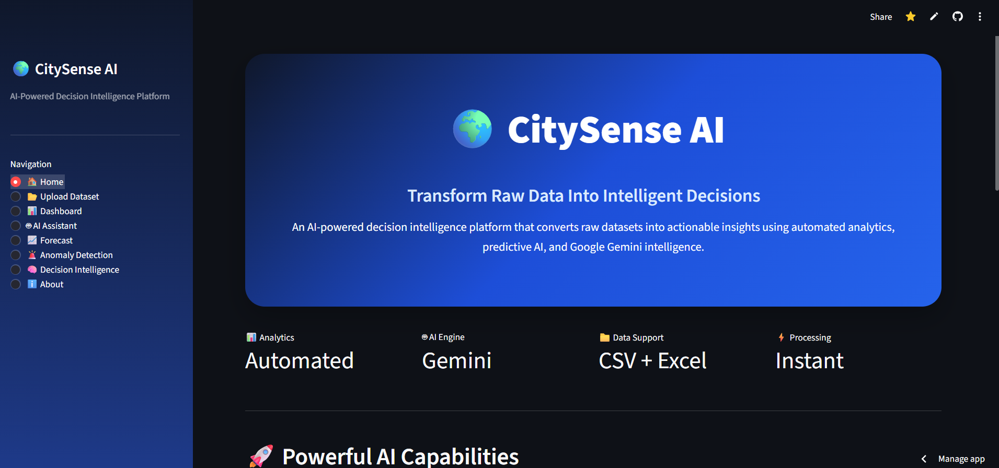
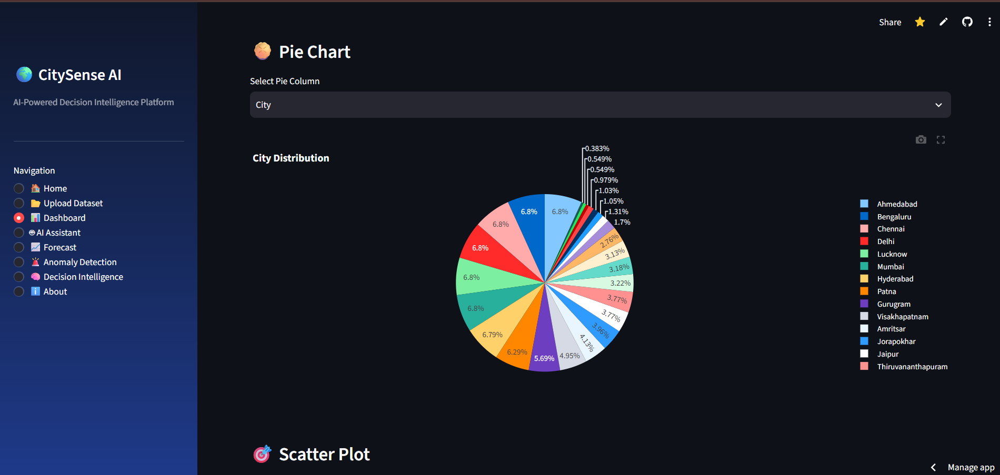

# CitySense-AI
AI-powered Decision Intelligence Platform that turns datasets into insights, forecasts, and recommendations using Streamlit and Google Gemini AI.
# 🌍 CitySense AI

<h3 align="center">
AI-Powered Decision Intelligence Platform
</h3>

<p align="center">
Transform raw datasets into intelligent decisions using AI analytics, predictive intelligence, and automated insights.
</p>


<p align="center">


</p>


---

# 🚀 Overview

**CitySense AI** is an AI-powered Decision Intelligence Platform that converts raw datasets into meaningful insights, predictions, and recommendations.

The platform enables users to upload CSV or Excel datasets and automatically performs:

- Data cleaning
- Exploratory data analysis
- Interactive visualization
- AI-powered insights
- Forecasting
- Anomaly detection
- Decision recommendations


CitySense AI combines **Data Analytics + Machine Learning + Generative AI** to help organizations make faster and smarter decisions.

---

# 🎯 Problem Statement

Modern organizations collect huge amounts of data, but extracting meaningful insights requires:

- Technical expertise
- Manual analysis
- Time-consuming reporting
- Complex tools


CitySense AI solves this problem by providing an intelligent analytics assistant that allows users to upload data and instantly receive:

✅ Automated analysis  
✅ AI explanations  
✅ Future predictions  
✅ Actionable recommendations  


---

# ✨ Features


## 📊 Smart Analytics

Automatically analyze datasets and generate:

- Dataset quality reports
- Statistical summaries
- Interactive charts
- Data distributions
- Pattern discovery


Capabilities:

✔ Automatic data cleaning  
✔ Missing value detection  
✔ Duplicate removal  
✔ Data profiling  


---

# 🤖 Gemini AI Data Assistant

Interact with your dataset using natural language.

Users can ask questions like:


```
What are the important insights from this dataset?
```

```
Which category performs best?
```

```
Find unusual patterns.
```

```
What decisions should I take based on this data?
```


The AI assistant analyzes the dataset and provides human-like explanations.


Powered by:

**Google Gemini AI**

---

# 🔮 Predictive Intelligence

CitySense AI uses machine learning techniques to identify future trends.

Features:

- Future value prediction
- Trend analysis
- Forecast visualization
- Pattern recognition


Example:

Predict future city pollution levels using historical data.


---

# 🚨 Anomaly Detection

Automatically identifies unusual patterns and abnormal records.


Applications:

- Smart city monitoring
- Fraud detection
- Business operations
- Risk analysis


Provides:

✔ Number of anomalies detected  
✔ Anomaly records  
✔ Downloadable reports  


---

# 🧠 AI Decision Intelligence

Transforms analytics into decisions.

Generates:

- Key findings
- Important metrics
- Business recommendations
- Actionable insights


Example:

```
Air quality is degrading in specific regions.
Recommended action:
Increase monitoring and optimize pollution control measures.
```


---

# 🏗️ How CitySense AI Works


```
                 User

                  |
                  ↓

          Upload Dataset

                  |
                  ↓

        Automatic Data Cleaning

                  |
                  ↓

          AI Data Analysis

                  |
                  ↓

   Visualization + Forecasting

                  |
                  ↓

      Intelligent Decisions

```


---

# 🖥️ Application Workflow


## Step 1: Upload Dataset

Supported formats:

- CSV
- Excel (.xlsx)


The system automatically processes uploaded files.


---

## Step 2: AI Analysis

CitySense AI performs:

- Data preprocessing
- Statistical analysis
- Visualization generation
- Pattern discovery


---

## Step 3: Generate Intelligence

Users receive:

- Interactive dashboards
- AI insights
- Forecast results
- Anomaly reports
- Decision recommendations


---

# 🏛️ System Architecture


```
                    User

                     |

                     ↓

              Streamlit UI

                     |

                     ↓

          Data Processing Layer

                     |

        ----------------------------

        |             |            |

        ↓             ↓            ↓


   Analytics      ML Models    Gemini AI


        |             |            |

        ----------------------------

                     |

                     ↓

          Intelligent Insights

```


---

# 🛠️ Technology Stack


## Programming Language

- Python


## Frontend

- Streamlit
- HTML
- CSS


## Data Processing

- Pandas
- NumPy


## Data Visualization

- Plotly
- Matplotlib


## Machine Learning

- Scikit-learn


## Artificial Intelligence

- Google Gemini API


## Development Tools

- Git
- GitHub
- VS Code
- Google Colab


---

# 📂 Project Structure


```
CitySense-AI/

│
├── app.py
│
├── analytics/
│   │
│   ├── cleaning.py
│   ├── forecasting.py
│   ├── anomaly.py
│   └── decision.py
│
├── dashboard/
│   │
│   └── charts.py
│
├── ai/
│   │
│   └── gemini.py
│
├── requirements.txt
│
├── README.md
│
└── assets/

    ├── home.png
    ├── dashboard.png
    └── ai_assistant.png

```


---

# ⚙️ Installation


## Clone Repository


```bash
git clone https://github.com/yourusername/CitySense-AI.git
```


Move into project folder:


```bash
cd CitySense-AI
```


---

## Install Dependencies


```bash
pip install -r requirements.txt
```


---

# 🔑 Environment Setup


Create a `.env` file:


```
GOOGLE_API_KEY=your_gemini_api_key
```


Add your Google Gemini API key.


---

# ▶️ Run Application


Start Streamlit:


```bash
streamlit run app.py
```


Application will open:


```
http://localhost:8501
```


---

# 📸 Screenshots


## 🏠 Home Page




---

## 📊 Analytics Dashboard




---

## 🤖 AI Assistant


# 🌍 Real-World Applications


## Smart Cities

Applications:

- Air quality monitoring
- Traffic analytics
- Urban planning
- Environmental intelligence


---

## Business Intelligence

Applications:

- Sales analysis
- Customer behavior analysis
- Performance monitoring


---

## Operations Intelligence

Applications:

- Risk detection
- Forecasting
- Decision support


---

# 🏆 Hackathon Project


Built for:

## Google Cloud Gen AI Academy Hackathon


Team:

## PromptForge


Project Vision:

> Democratizing advanced analytics by combining Artificial Intelligence with automated decision intelligence.


---

# 🚀 Future Enhancements


Future improvements:

- Real-time IoT data integration
- AI-powered dashboard generation
- Multi-agent AI analytics
- Cloud deployment
- Advanced forecasting models
- Voice-based data interaction
- Automated report generation


---

# 📈 Project Highlights


⭐ AI-powered analytics platform

⭐ Automated dataset understanding

⭐ Generative AI integration

⭐ Machine learning forecasting

⭐ Interactive dashboards

⭐ Decision intelligence system


---

# 👨‍💻 Developed With ❤️


## CitySense AI

AI-Powered Decision Intelligence Platform


Built using:

```
Python
Streamlit
Machine Learning
Google Gemini AI
Data Analytics
```


---

<p align="center">

⭐ If you found this project useful, consider giving it a star!

</p>
